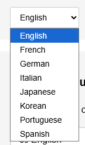

# Google Translate Widget

A simple, lightweight npm package that provides easy Google Translate integration for any HTML project including Angular, React, Vue, or plain HTML/JavaScript.


## 🌐 Live Demo

**[See Live Demo Here](https://vitolrosario.github.io/google-translate-widget)**

## Features

- 🎯 **Easy Integration**: Just add a `<div>` and initialize
- 🎨 **Customizable**: Use defined styles or use your own UI while leveraging Google Translate (select, buttons, etc.)
- 🚫 **Clean UI**: Hides all Google Translate visual elements
- 📱 **Framework Agnostic**: Works with any frontend framework
- 🌍 **Language Detection**: Automatically detects language changes


> **Note:** If you have an element you do **not** want translated, add the `notranslate` class to that element:
>
> ```html
> <div class="notranslate">This will never be translated</div>
> ```

## Installation

### For Pure HTML (No Build Tools)

```html
<div id="translate" class="notranslate"></div>

<script type="module">
  import { translatorWidget, TranslatorWidgetLayout } from 'https://unpkg.com/google-translate-widget@latest/index.js';
    
  translatorWidget({
    element: "translate",
    includedLanguages: ['en', 'es', 'fr', 'de', 'it', 'pt'],
    defaultLanguage: 'en',
    layout: TranslatorWidgetLayout.SIMPLE,
  });

  // If you have a custom select:
  document.getElementById('languageSelect')?.addEventListener('change', function(e) {
    window.translator.onChange(e);
  });
</script>
```

### For Frameworks (React, Angular, Vue, etc.)

```bash
npm install google-translate-widget
```

## Quick Start

### Simple Layout (Plug & Play)

The easiest way to get started with a built-in language selector:

```html
<div id="translate"></div>
```

```javascript
import { translatorWidget, TranslatorWidgetLayout } from 'google-translate-widget';

translatorWidget({
    element: "translate",
    includedLanguages: ['en', 'es', 'fr', 'de', 'it', 'pt'],
    defaultLanguage: 'en',
    layout: TranslatorWidgetLayout.SIMPLE
});
```

### Custom Layout (Full Control)

For complete design freedom, use the custom layout:

```html
<div id="translate"></div>
<!-- Your custom UI here -->
<select id="myLanguageSelect">
    <!-- Options will be populated from window.translator.languages -->
</select>
```

```javascript
import { translatorWidget, TranslatorWidgetLayout } from 'google-translate-widget';

translatorWidget({
    element: "translate",
    includedLanguages: ['en', 'es', 'fr', 'de', 'it', 'pt'],
    defaultLanguage: 'en',
    layout: TranslatorWidgetLayout.CUSTOM,
    onLanguageChange: (language, isDefault) => {
        console.log('Language changed to:', language);
    }
});

// Use window.translator.languages to populate your UI
// Use window.translator.onChange(langCode) to trigger translations
document.getElementById('myLanguageSelect').addEventListener('change', (e) => {
    window.translator.onChange(e);
});
```

## Layouts

### TranslatorWidgetLayout.SIMPLE
A ready-to-use dropdown selector that requires no additional coding. Perfect for quick integration.



### TranslatorWidgetLayout.RADIO
A simple radio button layout for language selection. Ideal for forms or when space is limited.


### TranslatorWidgetLayout.CUSTOM  
Provides `window.translator` object with languages array and onChange function. Gives you complete control over the UI design.


### Using Buttons for Language Switching

If you want to implement buttons to change the language, use `TranslatorWidgetLayout.CUSTOM` and call `window.translator.translateTo(langCode)` when a button is clicked.

**Example:**

```html
<button onclick="window.translator.translateTo('en')">English</button>
<button onclick="window.translator.translateTo('es')">Español</button>
<button onclick="window.translator.translateTo('fr')">Français</button>
```

See a live example in [my portfolio](https://vrosario-portafolio.web.app).

## Configuration Options

| Option | Type | Default | Description |
|--------|------|---------|-------------|
| `element` | String | `'google_translate'` | ID of the HTML element to attach to |
| `includedLanguages` | Array | `['en', 'es', 'fr', 'de', 'it', 'pt']` | Language codes to include |
| `defaultLanguage` | String | `'en'` | Default page language |
| `layout` | TranslatorWidgetLayout | `SIMPLE` | Layout type (SIMPLE or CUSTOM) |
| `onLanguageChange` | Function | `null` | Callback when language changes |

## Global Translator Object (Custom Layout)

When using `TranslatorWidgetLayout.CUSTOM`, the widget exposes `window.translator`:

```javascript
window.translator = {
  translateTo: (langCode) => void,           // Translate to specific language
  getCurrentLanguage: () => string,          // Get current language code
getAvailableLanguages: () => Language[],     // Array of available languages
  onChange: (event|langCode) => void         // Easy event handler for your UI when using custom layout
}
```

## Available Languages

The package includes support for 16+ languages including English, Spanish, French, German, Italian, Portuguese, Russian, Chinese, Japanese, Korean, Arabic, Hindi, and more.

**For the complete list of available languages with their codes, see [`languages.js`](./languages.js)**

## Framework Examples

### React Example (Simple Layout)

```jsx
import React, { useEffect } from 'react';
import { translatorWidget, TranslatorWidgetLayout } from 'google-translate-widget';

function SimpleTranslateComponent() {
  useEffect(() => {
    translatorWidget({
      element: "translate",
      includedLanguages: ['en', 'es', 'fr', 'de'],
      defaultLanguage: 'en',
      layout: TranslatorWidgetLayout.SIMPLE
    });
  }, []);

  return <div id="translate"></div>;
}
```

### React Example (Custom Layout)

```jsx
import React, { useEffect, useState } from 'react';
import { translatorWidget, TranslatorWidgetLayout } from 'google-translate-widget';

function TranslateComponent() {
  const [languages, setLanguages] = useState([]);
  const [currentLang, setCurrentLang] = useState('en');

  useEffect(() => {
    translatorWidget({
      element: "translate",
      includedLanguages: ['en', 'es', 'fr', 'de'],
      defaultLanguage: 'en',
      layout: TranslatorWidgetLayout.CUSTOM,
      onLanguageChange: (lang) => setCurrentLang(lang)
    });

    // Wait for translator to initialize
    setTimeout(() => {
      if (window.translator) {
        setLanguages(window.translator.languages);
      }
    }, 1000);
  }, []);

  return (
    <div>
      <div id="translate"></div>
      {languages.map(lang => (
        <button 
          key={lang.code}
          onClick={() => window.translator.onChange(lang.code)}
          className={currentLang === lang.code ? 'active' : ''}
        >
          {lang.name}
        </button>
      ))}
    </div>
  );
}
```

### Angular Example (Simple Layout)

```typescript
import { Component, OnInit } from '@angular/core';
import { translatorWidget, TranslatorWidgetLayout } from 'google-translate-widget';

@Component({
  selector: 'app-simple-translate',
  template: `<div id="translate"></div>`
})
export class SimpleTranslateComponent implements OnInit {
  ngOnInit() {
    translatorWidget({
      element: "translate",
      includedLanguages: ['en', 'es', 'fr', 'de'],
      defaultLanguage: 'en',
      layout: TranslatorWidgetLayout.SIMPLE
    });
  }
}
```

### Angular Example (Custom Layout)

```typescript
import { Component, OnInit } from '@angular/core';
import { translatorWidget, TranslatorWidgetLayout } from 'google-translate-widget';

@Component({
  selector: 'app-translate',
  template: `
    <div id="translate"></div>
    <div *ngFor="let lang of languages" 
         class="language-option"
         [class.active]="currentLanguage === lang.code"
         (click)="changeLanguage(lang.code)">
      {{ lang.name }}
    </div>
  `
})
export class TranslateComponent implements OnInit {
  languages: any[] = [];
  currentLanguage = 'en';

  ngOnInit() {
    translatorWidget({
      element: "translate", 
      includedLanguages: ['en', 'es', 'fr', 'de'],
      defaultLanguage: 'en',
      layout: TranslatorWidgetLayout.CUSTOM,
      onLanguageChange: (lang: string) => {
        this.currentLanguage = lang;
      }
    });

    // Wait for translator to initialize
    setTimeout(() => {
      if ((window as any).translator) {
        this.languages = (window as any).translator.languages;
      }
    }, 1000);
  }

  changeLanguage(langCode: string) {
    if ((window as any).translator) {
      (window as any).translator.onChange(langCode);
    }
  }
}
```

## API Reference

### initGoogleTranslate(config)

Initializes the Google Translate widget.

**Returns:** Object with translation methods

```javascript
{
  translateTo: (langCode: string) => void,
  goBackToOriginal: () => void,
  getCurrentLanguage: () => string,
  getAvailableLanguages: () => Array<{code: string, name: string}>
  onChange: (event|langCode: string) => void
}
```

### translateTo(langCode)

Translates the page to the specified language.
If original language is selected, it restores the page to its original state (not translating back).

**Parameters:**
- `langCode` (string): Language code (e.g., 'es', 'fr', 'de')


### getCurrentLanguage()

Returns the currently active language code.

### getAvailableLanguages()

Returns an array of available language objects with `code` and `name` properties.

## Styling

The widget automatically hides all Google Translate UI elements. You can create your own custom language selector using the provided API methods.

## Browser Support

- Chrome 60+
- Firefox 60+
- Safari 12+
- Edge 79+

## License

MIT

## Contributing

Pull requests are welcome. For major changes, please open an issue first to discuss what you would like to change.